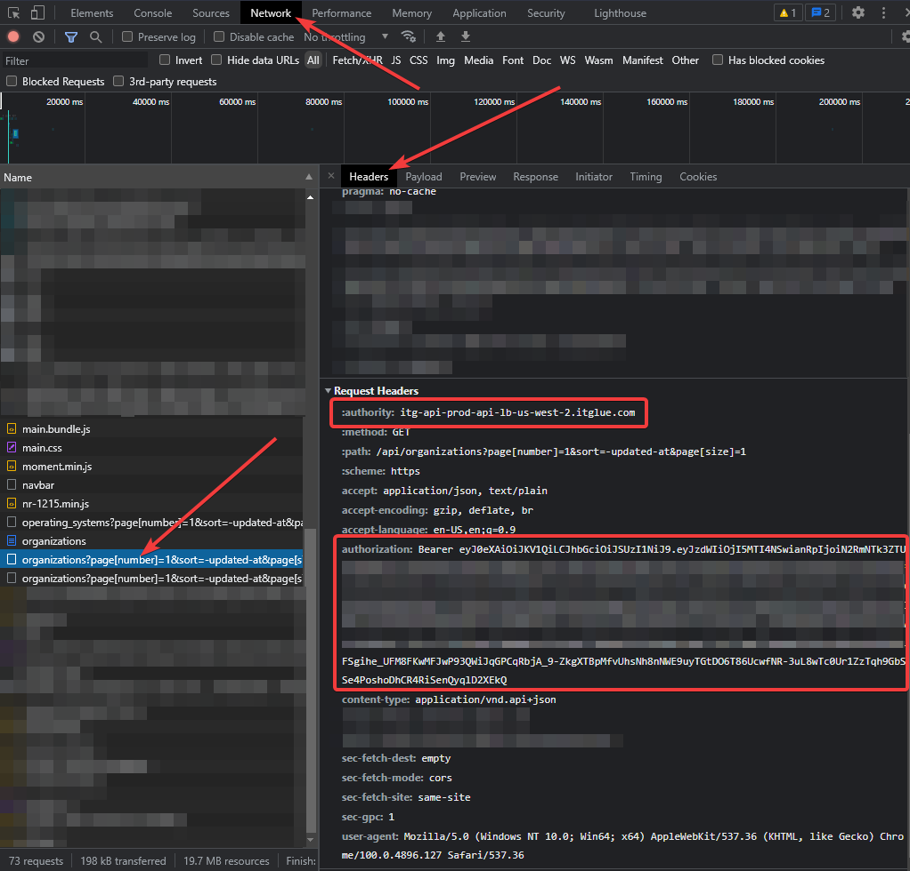

# Defunct 😐
ITGlue removed the ability to parse the OTP from their hidden API, thus this project is defunct. Keeping it public for posterity.

# Overview
Gets ITGlue passwords with one time password secrets!

# Requirements
- PowerShell v5
- [ITGlueAPIv2 Module by lwhitelock](https://github.com/lwhitelock/ITGlueAPIv2) (Will be installed if not available)
- Bearer token and authority data gathering before running the script. Read the Process section.

# Process
This script utilizes both the ITGlue API and your ITGlue login session to gather password information. It is expected that this should be run interactively, but automating the execution of this script may be possible.

Before running the script, there are a couple of data pieces that you must gather. This tutorial assumes that you are using some form of Chromium browser.

## BearerToken and Authority
To find the strings to use for the `BearerToken` and `Authority` parameters:

1. Log into ITGlue. You must remain logged into ITGlue for the duration of the script run.
2. Press `F12` to open the Chromium DevTools.
3. Navigate to the Organizations section of ITGlue.
4. Navigate to the `Network` tab in the DevTools.
   - If you don't see anything in the `Name` section, refresh the ITGlue page.
5. Locate the entry in the `Name` section that starts with `organizations?page[number]=1`. It should be an `xhr` type. Click on it and it will open the `Headers` tab for this request.
6. Scroll to the bottom of the `Headers` section until you find the `Request Headers` section.
7. The `Authority` parameter of this script should be set to the ***value*** of the `:authority:` section. 
8. The `BearerToken` parameter of this script should be set to the ***value*** of the `authorization` section. (If you log out of ITGlue, this token will be invalidated and you will need to log in and get a new one.)

# Payload Usage
```powershell
$passwords = .\Get-ITGluePasswordsExtended.ps1 `
    -APIKey "ITG.abcdefg123456..." `
    -Authority 'itg-api-prod-api-lb-us-west-2.itglue.com' `
    -BearerToken 'Bearer usdifnbuidsfnbiusdfnbiusdnfb...'
$passwords.attributes | Export-CSV -Path 'C:\temp\mypasswords.csv' -NoTypeInformation
```

# Parameters
| Parameter     | Required | Type   | Description                                               |
| ------------- | -------- | ------ | --------------------------------------------------------- |
| `APIKey`      | True     | String | An API key for ITGlue with password access.               |
| `BearerToken` | True     | String | The bearer token to use for parsing individual passwords. |
| `Authority`   | True     | String | The authority to use for parsing individual passwords.    |
